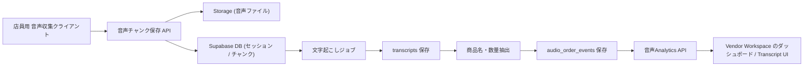

# 音声版 店舗Analytics β版 実装計画

最終更新: 2026-05-09

## 1. 目的

この計画は、音声版 店舗Analytics を **β版として既存プロダクトへ載せるための実装計画** をまとめたものです。

今回のゴールは、要件定義にある通り、

- 店員音声から
- 商品名と数量を抽出し
- 商品別販売数 / 注文回数 / 時間帯別傾向を可視化できる

ところまでを、現実的なスコープで作ることです。

POS や決済、売上会計の置き換えは狙いません。

---

## 2. β版の前提

### 2-1. β版で検証したい仮説

β版では、以下を主仮説に置きます。

1. 店員音声から商品販売数を一定精度で推定できる
2. alias 辞書と数量正規化を入れることで、現場で使える精度まで伸ばせる
3. 会計データがなくても、店舗会話由来の傾向分析には価値がある

### 2-2. β版の位置づけ

音声版 店舗Analytics は、

- 音声POS
- 注文管理システム
- 会計システム

ではなく、

**「店舗会話を構造化して Analytics に変えるプロダクト」**

として扱います。

---

## 3. 既存プロダクトへの載せ方

### 3-1. 再利用する既存資産

このリポジトリには、すでに以下の土台があります。

- ベンダー認証
- Vendor Workspace
- 商品マスタ
- Analytics 系 UI
- Supabase の保存基盤
- API Route 構成

そのため、β版では **音声入力と音声由来データモデルを追加** するのが中心になります。

### 3-2. 追加するレイヤー

β版では次の3層で構成します。

1. 音声収集クライアント
2. 音声解析パイプライン
3. 既存ベンダー分析画面への表示

### 3-3. 重要な設計判断

#### 音声収集は純Web前提にしない

要件にある

- Bluetooth マイク
- 長時間利用
- バックグラウンド録音

を安定して満たすには、ブラウザ単体より **React Native / Expo 等のネイティブ寄り実装** の方が安全です。

そのため、β版では

- 管理画面 / Analytics: 既存 Next.js
- 録音: 別の音声収集クライアント

という分担を前提にします。

---

## 4. β版スコープ

### 4-1. Must

β版で最低限必要なもの:

1. 音声セッションの開始 / 停止
2. 長時間録音の分割保存
3. 文字起こし
4. 商品 alias 辞書
5. 数量正規化
6. 音声由来の注文イベント保存
7. 商品別販売数集計
8. 時間帯別集計
9. Transcript 画面
10. 音声ダッシュボード

### 4-2. ぜひやりたい

1. 認識信頼度の保存と表示
2. alias 管理 UI
3. セッション一覧
4. 認識失敗ログの確認

### 4-3. Better

1. 抽出結果の手修正
2. 複数商品同時発話対応
3. 店員別セッション識別
4. ノイズ / 無音区間の自動圧縮

### 4-4. 今回やらない

1. POS 連携
2. 決済
3. 在庫管理
4. レシート発行
5. 売上金額計算
6. リアルタイム注文処理
7. AI 接客
8. 顧客音声解析

---

## 5. アーキテクチャ案

## 5-1. 全体像

## 5-2. レイヤーごとの責務

### 音声収集クライアント

- マイク入力
- Bluetooth ヘッドセット利用
- チャンク分割
- アップロード
- セッション状態表示

### Next.js / Supabase

- セッション作成
- 音声メタ保存
- transcript 保存
- 商品抽出イベント保存
- 集計 API
- UI 表示

### 解析パイプライン

- STT
- alias 辞書照合
- 数量抽出
- 時系列ログ化

---

## 6. データモデル案

β版では、既存の `transactions` / `product_sales` には直接寄せず、**音声専用のイベント系列** として持つ方が安全です。

追加テーブルは以下を想定します。

### 6-1. `audio_capture_sessions`

- 録音セッション単位
- いつ誰が録音を開始したか
- どのデバイスか
- 状態はどうか

### 6-2. `audio_capture_chunks`

- 分割した音声ファイル単位
- 保存先
- 再送状態
- 文字起こし状態

### 6-3. `audio_transcripts`

- 発話ログ単位
- 時刻
- 認識テキスト
- 信頼度

### 6-4. `audio_order_events`

- transcript から抽出した商品 / 数量イベント
- 商品 ID
- 生テキスト
- 正規化後商品名
- 数量
- 抽出信頼度

### 6-5. `product_aliases`

- 商品ごとの別名辞書
- `コーラ`, `こーら`, `コカコーラ`
- `ホットドッグ`, `ホット`
など

詳細な SQL たたき台は以下に置く:

- [audio-analytics-foundation.sql](/Users/yukikuchi/Documents/1.KX/仲町CS/kitchencar-app/sql/audio-analytics-foundation.sql)

---

## 7. API 設計のたたき台

### 7-1. セッション系

- `POST /api/audio/sessions`
- `PATCH /api/audio/sessions/:id`
- `GET /api/audio/sessions`

### 7-2. チャンク系

- `POST /api/audio/chunks`
- `GET /api/audio/chunks/:id`

### 7-3. transcript / 抽出系

- `POST /api/audio/transcripts`
- `GET /api/audio/transcripts`
- `POST /api/audio/extract-order-events`

### 7-4. Analytics 系

- `GET /api/audio/analytics/products`
- `GET /api/audio/analytics/hourly`
- `GET /api/audio/analytics/transcripts`

### 7-5. alias 管理

- `GET /api/products/aliases`
- `POST /api/products/aliases`
- `PATCH /api/products/aliases/:id`
- `DELETE /api/products/aliases/:id`

---

## 8. 実装フェーズ

## Phase 0: 技術検証

目的:
- 店舗音声で商品抽出が成立するか確認する

やること:
1. 小さな商品辞書を作る
2. 実音声を数十分集める
3. STT を試す
4. 商品名 / 数量抽出の誤差を観察する
5. alias 候補を洗い出す

成果物:
- サンプル音声
- 誤認識パターン集
- alias 初期セット

## Phase 1: DB / API 基盤

目的:
- 音声データを受けて保存できるようにする

やること:
1. SQL 追加
2. 型追加
3. API Route 雛形
4. transcript / order event 保存

## Phase 2: 収集クライアント

目的:
- 録音開始 / 停止 / チャンク保存ができるようにする

やること:
1. セッション開始 / 停止
2. バックグラウンド録音
3. 30〜60秒分割
4. 再送

## Phase 3: STT と商品抽出

目的:
- 音声から商品数を推定する

やること:
1. STT
2. transcript 保存
3. alias 辞書照合
4. 数量抽出
5. `audio_order_events` 保存

## Phase 4: Analytics UI

目的:
- 見える形にする

やること:
1. 商品別販売ランキング
2. 時間帯別推移
3. Transcript 一覧
4. 推定数量表示

## Phase 5: 精度評価

目的:
- β版として出せる精度か判断する

やること:
1. 商品認識精度計測
2. 数量認識精度計測
3. 長時間運用テスト
4. 騒音環境テスト

---

## 9. β版公開までのおすすめ順

現実的には次の順が安全です。

1. Phase 0 技術検証
2. Phase 1 DB / API 基盤
3. Phase 3 STT / 商品抽出
4. Phase 4 Analytics UI
5. Phase 2 収集クライアント
6. Phase 5 精度評価

理由:
- 先に収集アプリを作り込むより
- まず「抽出精度が出るか」を確認した方が投資判断しやすいため

---

## 10. リポジトリ上の実装単位

### SQL

- `/Users/yukikuchi/Documents/1.KX/仲町CS/kitchencar-app/sql/audio-analytics-foundation.sql`

### 型

- `/Users/yukikuchi/Documents/1.KX/仲町CS/kitchencar-app/src/types/audio-analytics.ts`

### lib

- `/Users/yukikuchi/Documents/1.KX/仲町CS/kitchencar-app/src/lib/audio/transcription.ts`
- `/Users/yukikuchi/Documents/1.KX/仲町CS/kitchencar-app/src/lib/audio/extract-order-events.ts`
- `/Users/yukikuchi/Documents/1.KX/仲町CS/kitchencar-app/src/lib/audio/normalize-quantity.ts`
- `/Users/yukikuchi/Documents/1.KX/仲町CS/kitchencar-app/src/lib/audio/product-alias.ts`

### API

- `/Users/yukikuchi/Documents/1.KX/仲町CS/kitchencar-app/src/app/api/audio/sessions/route.ts`
- `/Users/yukikuchi/Documents/1.KX/仲町CS/kitchencar-app/src/app/api/audio/chunks/route.ts`
- `/Users/yukikuchi/Documents/1.KX/仲町CS/kitchencar-app/src/app/api/audio/transcripts/route.ts`
- `/Users/yukikuchi/Documents/1.KX/仲町CS/kitchencar-app/src/app/api/audio/analytics/products/route.ts`
- `/Users/yukikuchi/Documents/1.KX/仲町CS/kitchencar-app/src/app/api/audio/analytics/hourly/route.ts`

### UI

- `/Users/yukikuchi/Documents/1.KX/仲町CS/kitchencar-app/src/app/audio-analytics/page.tsx`
- `/Users/yukikuchi/Documents/1.KX/仲町CS/kitchencar-app/src/app/audio-analytics/transcripts/page.tsx`
- `/Users/yukikuchi/Documents/1.KX/仲町CS/kitchencar-app/src/app/products/aliases/page.tsx`

---

## 11. リスクと対策

### 11-1. 収集リスク

- 長時間録音が端末制約で止まる
- Bluetooth が切れる
- ノイズが強い

対策:
- ネイティブ寄り構成
- チャンク分割
- 再送設計

### 11-2. 認識リスク

- 商品名の揺れ
- 数量表現の揺れ
- 複数商品同時発話

対策:
- alias 辞書
- 数量正規化
- 単一商品 + 単一数量から始める

### 11-3. UX リスク

- 店員が録音操作を嫌がる
- 装着負荷が高い

対策:
- 開始 / 停止だけの単純 UI
- 教育不要レベルのシンプルさ優先

---

## 12. β版の成功条件

最低限の判断基準:

1. 商品認識精度 85% 以上
2. 数量認識精度 80% 以上
3. 6時間級の運用で致命停止しない
4. 商品別販売数ランキングが「現場感覚とズレすぎない」
5. Transcript を見れば、何が起きたか人間が追える

---

## 13. この計画の使い方

このドキュメントは、

- β版の実装計画
- DB / API / UI の着手順
- 技術判断の基準

として使う。

実装タスクを切る時は、まず

- [audio-analytics-week1-tickets.md](/Users/yukikuchi/Documents/1.KX/仲町CS/kitchencar-app/docs/audio-analytics-week1-tickets.md)

を起点に進める。
