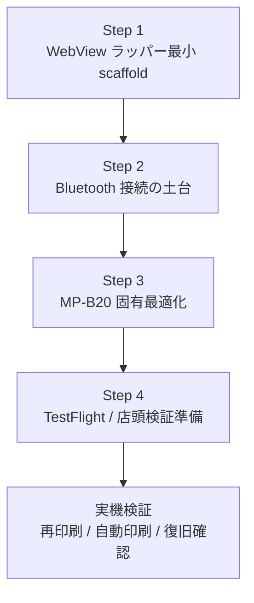

# iOS WebView ラッパー実装ロードマップ

最終更新: 2026-05-20

## 目的

- クリダスの **iPad 向け WebView ラッパーアプリ** を、Codex を使って段階的に実装する
- MVP では **SII MP-B20** を対象に、以下の 2 つを成立させる
  - 注文管理画面からの `再印刷`
  - POS 会計受領後の `自動印刷`

## 前提

- クリダス本体は引き続き **Web アプリ**
- Safari 単体ではなく **WebView ラッパーアプリ** を使う
- Web 側契約はすでに固定済み
  - [ios-webview-wrapper-bridge-contract.md](/Users/yukikuchi/Documents/1.KX/仲町CS/kitchencar-app/docs/ios-webview-wrapper-bridge-contract.md)
  - [ios-webview-wrapper-native-receiver-spec.md](/Users/yukikuchi/Documents/1.KX/仲町CS/kitchencar-app/docs/ios-webview-wrapper-native-receiver-spec.md)
  - [ios-webview-wrapper-mvp-verification-checklist.md](/Users/yukikuchi/Documents/1.KX/仲町CS/kitchencar-app/docs/ios-webview-wrapper-mvp-verification-checklist.md)

## 全体像

## Step 1

### 目的

- iPad アプリとして **WKWebView + bridge 受け口** の最小構成を作る
- Bluetooth なしでも、Web → native → Web callback の往復を成立させる

### Codex への依頼内容

- Xcode / Swift の最小 scaffold
- `WKWebView`
- `kuridasPrinter` の `WKScriptMessageHandler`
- request decode
- `accepted` callback

### 完了条件

- WebView が表示される
- `window.webkit.messageHandlers.kuridasPrinter.postMessage(...)` を受けられる
- `kuridas:native-receipt-print` の `accepted` callback を Web に返せる

### この段階でやらないこと

- Bluetooth 接続
- プリンター送信
- TestFlight 配布

## Step 2

### 目的

- **CoreBluetooth ベースの最小送信土台** を作る
- `receipt_print` request を受けて、scan / connect / discovery / write に進めるようにする

### Codex への依頼内容

- `Bluetooth Print Service`
- `Print Request Router`
- `Web Callback Adapter`
- `accepted / printed / failed` callback
- writable characteristic への最小書き込み

### 完了条件

- Bluetooth でプリンター探索を開始できる
- 書き込み可能 characteristic まで到達できる
- 最小の print request を native 側で処理できる

### この段階でやらないこと

- MP-B20 固有最適化
- スリープ復帰
- 再接続戦略の磨き込み

## Step 3

### 目的

- **SII MP-B20 固有の実運用寄り最適化** を入れる
- 再接続、スリープ復帰、送信安定化まで進める

### Codex への依頼内容

- MP-B20 向け service / characteristic 整理
- chunk サイズ調整
- 再接続戦略
- iPad スリープ復帰後の復旧
- プリンター再起動後の復旧
- 実機ログとエラー整備

### 完了条件

- 再印刷と自動印刷の両方で安定度が上がる
- 切断後や復帰後の振る舞いが整理される
- 実機検証時の失敗箇所が追いやすい

### 実機で特に確認すること

- iPad スリープ復帰
- プリンター電源 OFF / ON
- 用紙切れ
- 連続印刷

## Step 4

### 目的

- **TestFlight 前提の配布・設定・店頭検証準備** を整える
- 検証者が迷わずセットアップできるようにする

### Codex への依頼内容

- bundle / version / target 整理
- app configuration
- Bluetooth 権限まわり整理
- 接続状態や最終印刷結果を見られる最小 UI
- 検証手順 README / docs
- リリース前チェック項目整理

### 完了条件

- TestFlight に乗せる前提の構成が整う
- 初回セットアップ手順がある
- 店頭検証時の確認ポイントが画面か docs で分かる

## 実装順のおすすめ

1. Step 1: WebView ラッパー最小 scaffold
2. Step 2: Bluetooth 接続の土台
3. Step 3: MP-B20 固有最適化
4. Step 4: TestFlight / 店頭検証準備

## 実機到着前に進められるもの

- Step 1 全体
- Step 2 の大部分
- Step 4 の docs / 設定整理

## 実機到着後に必要なもの

- MP-B20 のペアリング
- GATT discovery 実測
- 実印字確認
- 再印刷確認
- POS 会計後自動印刷確認
- 切断 / 復帰 / 失敗時 fallback 確認

## 実機検証の入り方

最初は次の順が安全。

1. `再印刷`
2. `POS 会計後自動印刷`
3. `通常ブラウザ fallback`
4. `プリンター電源 OFF`
5. `用紙切れ`
6. `iPad スリープ復帰`
7. `連続印刷`

## Codex への依頼の出し方

1 本ずつ独立したチケットとして渡すのがよい。

- Step 1 指示文: WebView ラッパー scaffold
- Step 2 指示文: Bluetooth 接続の土台
- Step 3 指示文: MP-B20 固有最適化
- Step 4 指示文: TestFlight / 店頭検証準備

1 回で全部渡すより、**1 ステップずつレビューしながら進める** 方が失敗しにくい。

## 判断基準

### まず MVP として十分

- WebView でクリダスが問題なく動く
- `再印刷` が通る
- `料金受領を記録` 後の自動印刷が通る
- 印刷失敗時でも会計処理は止まらない

### 次に詰めるべきポイント

- スリープ復帰の安定性
- 切断後再接続
- 印刷待ち時間の短縮
- 検証ログの見やすさ

## 関連ドキュメント

- [ios-webview-wrapper-mvp-requirements.md](/Users/yukikuchi/Documents/1.KX/仲町CS/kitchencar-app/docs/ios-webview-wrapper-mvp-requirements.md)
- [ios-webview-wrapper-mvp-tickets.md](/Users/yukikuchi/Documents/1.KX/仲町CS/kitchencar-app/docs/ios-webview-wrapper-mvp-tickets.md)
- [ios-webview-wrapper-bridge-contract.md](/Users/yukikuchi/Documents/1.KX/仲町CS/kitchencar-app/docs/ios-webview-wrapper-bridge-contract.md)
- [ios-webview-wrapper-native-receiver-spec.md](/Users/yukikuchi/Documents/1.KX/仲町CS/kitchencar-app/docs/ios-webview-wrapper-native-receiver-spec.md)
- [ios-webview-wrapper-mvp-verification-checklist.md](/Users/yukikuchi/Documents/1.KX/仲町CS/kitchencar-app/docs/ios-webview-wrapper-mvp-verification-checklist.md)
- [ios-bluetooth-printing-prebuild-plan.md](/Users/yukikuchi/Documents/1.KX/仲町CS/kitchencar-app/docs/ios-bluetooth-printing-prebuild-plan.md)
