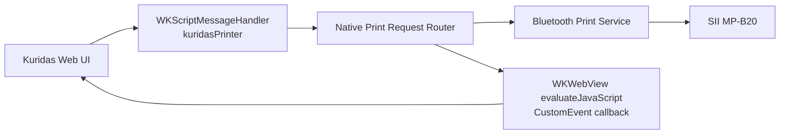

# iOS WebView ラッパー Native 受け口仕様

最終更新: 2026-05-20

## 目的

- クリダスの WebView ラッパーアプリ上で、Web 側から渡されるレシート印刷要求を **iOS ネイティブ層** で受け取り、Bluetooth プリンター印刷へ流せるようにする
- MVP では **SII MP-B20** を対象に、**再印刷** と **POS 受領後の自動印刷** を成立させる

## 対象

- `WKWebView`
- `window.webkit.messageHandlers.kuridasPrinter.postMessage(...)`
- Bluetooth 印刷担当の native service

## 非対象

- 汎用ブラウザ対応
- Safari 単体対応
- 複数プリンター切替
- バックグラウンド印刷キューの永続化
- App Store 公開向けの汎用 SDK 設計

## 全体構成



## 受け口

### message handler 名

- `kuridasPrinter`

### 期待する request

- Web 側の契約は [ios-webview-wrapper-bridge-contract.md](/Users/yukikuchi/Documents/1.KX/仲町CS/kitchencar-app/docs/ios-webview-wrapper-bridge-contract.md) に従う
- `kind` は `receipt_print`
- `bridge_version` は `1`

### iOS 側の最小実装

1. `WKUserContentController` に `kuridasPrinter` を登録
2. `userContentController(_:didReceive:)` で payload を受け取る
3. `kind == receipt_print` を確認
4. `bridge_version == 1` を確認
5. request を decode
6. Bluetooth 印刷 service に渡す

## Native モジュール責務

### 1. Print Request Router

責務:
- Web から来た request を parse
- `intent`
  - `auto_print`
  - `reprint`
  - `probe`
  を判別
- bridge version を検証
- 不正 payload を弾く
- Bluetooth service へ受け渡す

責務外:
- 実際の Bluetooth 接続処理
- ESC/POS データ生成

### 2. Bluetooth Print Service

責務:
- MP-B20 の接続状態確認
- 未接続なら接続
- 印字データ送信
- 成功 / 失敗を Router に返す

責務外:
- Web request の parse
- Web callback の組み立て

### 3. Web Callback Adapter

責務:
- `WKWebView.evaluateJavaScript(...)` で Web へ callback を返す
- `CustomEvent('kuridas:native-receipt-print', { detail })` を発火する

責務外:
- Bluetooth 接続処理
- 再試行制御

## callback の返し方

### 推奨

- `evaluateJavaScript` で WebView 内に callback event を dispatch する

```js
window.dispatchEvent(
  new CustomEvent('kuridas:native-receipt-print', {
    detail: {
      kind: 'receipt_print_result',
      bridge_version: 1,
      request_id: '...',
      status: 'printed',
      printer_vendor: 'sii_mp_b20',
      printer_connection: 'bluetooth',
      error_code: null,
      error_message: null,
      printed_at: '2026-05-20T10:12:34.000Z'
    }
  })
)
```

### status の運用

- `accepted`
  - request を native 側で受け付けた
  - Bluetooth 接続や印刷処理はまだ途中
- `printed`
  - 印刷成功
- `failed`
  - 印刷失敗
- `unsupported`
  - current runtime では受け口が処理不能

## iOS 側で最低限見るべき request 項目

- `request_id`
- `intent`
- `origin`
- `plain_text`
- `payload`
- `printer_hint.vendor`
- `printer_hint.connection`

MVP では特に
- `payload.header.value` = 注文番号
- `payload.body.items`
- `payload.footer.store_name`
- `payload.footer.ordered_at`

が印字の中核になる

## エラー時の基本方針

### 再印刷

- 印刷失敗なら `failed` を返す
- Web 側に再試行可能と分かるよう `error_message` を返す

### POS 自動印刷

- 印刷失敗でも会計は取り消さない
- `failed` を返して、Web 側は店員向け fallback 文言を出す

## iOS 実装の最小シナリオ

1. WebView で注文管理画面を開く
2. `レシートを再印刷` を押す
3. `kuridasPrinter` に request が来る
4. native が `accepted` callback を返す
5. Bluetooth 印刷成功後に `printed` callback を返す

次に

1. POS 注文を作る
2. 店員が `料金受領を記録`
3. auto print request が native に来る
4. 印刷成功なら `printed`
5. 失敗なら `failed`

## MVP 実装メモ

- まずは **MP-B20 1機種固定**
- `intent=probe` は、後で設定画面からネイティブ疎通確認に使える
- iPad スリープ復帰後は、再接続失敗の扱いを後続 Ticket で確認する
