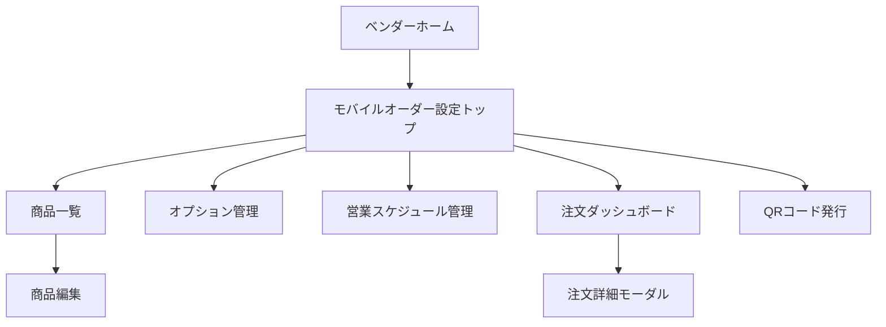
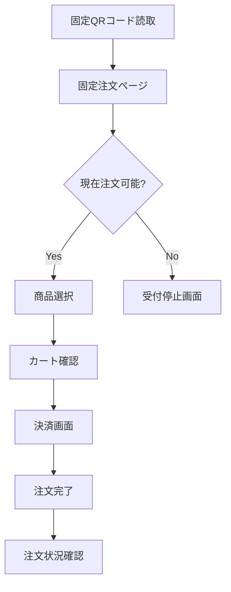

# クリダス モバイルオーダー導入計画（MVP）

## 1. 「注文業務フローを1本に固定する」とは

モバイルオーダーは、次の要素が全部つながっています。

- 店舗導線
- 注文方法
- 決済方法
- 調理ステータス管理
- 通知タイミング
- 受け渡し方法

このため、最初に複数パターンを同時に許容すると、画面設計・DB設計・運用がぶれやすくなります。

今回のMVPでは、まず以下の1本に固定して設計します。

1. 店頭に掲示したQRコードをユーザーが読み取る
2. LINEミニアプリまたはLIFF画面で、その店舗専用の固定注文画面を開く
3. システムが現在時刻と営業設定を照合し、注文受付可否を判定する
4. 営業時間内なら商品を選び、受け取り用ニックネームを入力する
5. クレジットカードで事前決済する
6. 注文が確定すると、注文番号が発行される
7. ベンダー管理画面の注文ダッシュボードに新規注文が表示される
8. ベンダーがステータスを「調理中」「完成」に更新する
9. ユーザーにLINE通知を送る
10. 店頭で注文番号とニックネームを確認して商品を受け渡す
11. ベンダーが「受取済」に更新して完了する

このフローに固定することで、MVPでは次のものを後回しにできます。

- 現地決済
- 複数店舗横断カート
- 時間指定受取
- 会員登録必須フロー
- PayPay決済
- 配達や呼び出しベル連携

## 2. MVPの前提

### 対象

- 既存のクリダスにログインしているベンダー
- 店頭でQRコードを読み取って注文する一般ユーザー

### MVPで実現すること

- ベンダーが商品とオプションを管理できる
- 店舗ごとの固定注文ページをQRコードで開ける
- 管理画面で営業日時を設定し、その時間帯だけ注文受付できる
- ユーザーがニックネーム付きで事前決済注文できる
- ベンダーが注文状況を管理できる
- LINEで注文完了通知、商品完成通知を送れる

### MVPでは後続に回すこと

- PayPay決済
- 複数営業時間帯の細かな出し分け
- 注文履歴/再注文
- クーポン
- ポイント
- 厳密な在庫連動
- 主催者向け集計連携

## 3. 業務フロー

### ユーザー注文フロー

1. ユーザーが店頭QRコードを読み取る
2. LINE内で店舗の固定注文ページを開く
3. システムが現在有効な営業枠を判定する
4. 営業中なら商品一覧から商品を選ぶ
5. オプションを選ぶ
6. カート確認後、ニックネームを入力する
7. クレジットカードで決済する
8. 注文完了画面で注文番号を表示する
9. LINEで注文完了通知を受け取る
10. 商品完成時にLINE通知を受け取る
11. 店頭で注文番号またはニックネームを伝えて受け取る
12. 営業時間外なら受付停止画面を表示する

### ベンダー運用フロー

1. ベンダーが管理画面で商品・オプションを登録する
2. ベンダーが固定注文ページ用の店舗設定を作成する
3. ベンダーが営業日と受付時間を設定する
4. 店舗掲示用の固定QRコードを出力する
5. 注文ダッシュボードで新規注文を確認する
6. 必要に応じて「調理中」に更新する
7. 商品完成時に「完成」に更新する
8. 受け渡し時に「受取済」に更新する

## 4. 画面一覧

### ベンダー管理画面

#### 4-1. モバイルオーダー設定トップ

- 目的: モバイルオーダー機能の入口
- 主な表示
- 営業状態
- 本日の注文件数
- 未対応注文数
- 商品数
- QRコード導線
- 主な操作
- 営業開始/停止
- 次回営業枠の確認
- 商品管理へ遷移
- 営業スケジュール管理へ遷移
- 注文ダッシュボードへ遷移
- QRコード発行へ遷移

#### 4-2. 商品一覧画面

- 目的: 商品管理
- 主な表示
- 商品名
- 価格
- 商品画像
- 表示状態
- 売り切れ状態
- 主な操作
- 新規作成
- 編集
- 並び順変更
- 表示/非表示切替
- 売り切れ切替

#### 4-3. 商品編集画面

- 目的: 商品詳細設定
- 入力項目
- 商品名
- 商品説明
- 価格
- 商品画像
- 表示順
- 公開状態
- 売り切れ状態
- 紐づくオプショングループ

#### 4-4. オプション管理画面

- 目的: 商品オプション管理
- 主な表示
- オプショングループ名
- 必須/任意
- 単一選択/複数選択
- 選択肢一覧
- 主な操作
- グループ作成
- 選択肢追加
- 価格加算設定
- 商品への紐付け

#### 4-5. 営業スケジュール管理画面

- 目的: 注文受付可能な日時を管理
- 主な表示
- 営業日
- 受付開始時刻
- 受付終了時刻
- 公開状態
- 現在の受付判定
- 主な操作
- 営業枠追加
- 編集
- 受付停止
- 臨時休業設定

#### 4-6. 注文ダッシュボード

- 目的: 注文対応の中心画面
- 主な表示
- 注文番号
- 注文時刻
- 営業枠
- ニックネーム
- 商品明細
- 合計金額
- 決済状態
- 注文ステータス
- 主な操作
- ステータス更新
- 注文詳細表示
- 未対応だけに絞る
- 受取済にする

#### 4-7. QRコード発行画面

- 目的: 店頭掲示用QRコード出力
- 主な表示
- 固定公開URL
- QRコード画像
- 店舗名
- 現在の受付状態
- 主な操作
- QR再生成
- 画像ダウンロード
- 印刷用レイアウト表示

### ユーザー向け画面

#### 4-8. 店舗注文トップ

- 目的: 店舗の注文入口
- 主な表示
- 店舗名
- 営業状態
- 現在の受付時間
- 商品一覧
- カート導線
- 注意事項

#### 4-9. 商品詳細モーダルまたは画面

- 目的: 商品選択
- 主な表示
- 商品画像
- 商品説明
- 価格
- オプション選択
- 数量
- カート追加ボタン

#### 4-10. カート確認画面

- 目的: 注文内容確認
- 主な表示
- 商品明細
- オプション明細
- 数量
- 小計/合計
- ニックネーム入力欄
- 決済へ進むボタン

#### 4-11. 決済画面

- 目的: クレジットカード決済
- 主な表示
- 注文内容要約
- 合計金額
- 決済フォーム

#### 4-12. 注文完了画面

- 目的: 注文完了案内
- 主な表示
- 注文番号
- ニックネーム
- 注文内容
- 受け取り案内
- LINE通知案内

#### 4-13. 注文状況確認画面

- 目的: 通知がなくても進捗確認できるようにする
- 主な表示
- 注文番号
- 現在ステータス
- 注文内容
- 受取案内

#### 4-14. 受付停止画面

- 目的: 営業時間外の案内
- 主な表示
- ただいま受付時間外
- 次回受付予定
- 店舗からのお知らせ

## 5. MVP DBテーブル設計案

既存の `user_profiles` `vendor_profiles` を前提に、モバイルオーダー用に以下を追加する想定です。

### 5-1. `vendor_stores`

ベンダーがモバイルオーダーを受ける店舗単位の設定。

- `id` uuid pk
- `vendor_user_id` uuid not null
- `store_name` text not null
- `slug` text not null unique
- `description` text null
- `hero_image_url` text null
- `is_mobile_order_enabled` boolean not null default false
- `is_accepting_orders` boolean not null default false
- `line_official_account_id` text null
- `created_at` timestamptz not null default now()
- `updated_at` timestamptz not null default now()

### 5-2. `store_order_pages`

QRコードで開く固定注文ページの定義。MVPでは1店舗1ページを想定する。

- `id` uuid pk
- `store_id` uuid not null references `vendor_stores(id)`
- `page_title` text not null
- `public_token` text not null unique
- `status` text not null default 'draft'
- `is_primary` boolean not null default true
- `notes` text null
- `created_at` timestamptz not null default now()
- `updated_at` timestamptz not null default now()

### 5-3. `store_order_schedules`

固定注文ページに対して、注文受付可能な営業枠を定義する。

- `id` uuid pk
- `store_id` uuid not null references `vendor_stores(id)`
- `order_page_id` uuid not null references `store_order_pages(id)`
- `business_date` date not null
- `opens_at` timestamptz not null
- `closes_at` timestamptz not null
- `status` text not null default 'scheduled'
- `notes` text null
- `created_at` timestamptz not null default now()
- `updated_at` timestamptz not null default now()
- unique(`order_page_id`, `business_date`, `opens_at`)

`status` の候補

- `scheduled`
- `open`
- `closed`
- `cancelled`

### 5-4. `mobile_order_products`

- `id` uuid pk
- `store_id` uuid not null references `vendor_stores(id)`
- `name` text not null
- `description` text null
- `price` integer not null
- `image_url` text null
- `sort_order` integer not null default 0
- `is_published` boolean not null default true
- `is_sold_out` boolean not null default false
- `created_at` timestamptz not null default now()
- `updated_at` timestamptz not null default now()

### 5-5. `mobile_order_option_groups`

- `id` uuid pk
- `store_id` uuid not null references `vendor_stores(id)`
- `name` text not null
- `is_required` boolean not null default false
- `selection_type` text not null
- `min_select` integer null
- `max_select` integer null
- `sort_order` integer not null default 0
- `created_at` timestamptz not null default now()
- `updated_at` timestamptz not null default now()

`selection_type` の候補

- `single`
- `multiple`

### 5-6. `mobile_order_option_choices`

- `id` uuid pk
- `group_id` uuid not null references `mobile_order_option_groups(id)`
- `name` text not null
- `price_delta` integer not null default 0
- `sort_order` integer not null default 0
- `is_active` boolean not null default true
- `created_at` timestamptz not null default now()
- `updated_at` timestamptz not null default now()

### 5-7. `mobile_order_product_option_groups`

商品とオプショングループの中間テーブル。

- `id` uuid pk
- `product_id` uuid not null references `mobile_order_products(id)`
- `option_group_id` uuid not null references `mobile_order_option_groups(id)`
- `sort_order` integer not null default 0
- unique(`product_id`, `option_group_id`)

### 5-8. `mobile_orders`

注文ヘッダ。

- `id` uuid pk
- `store_id` uuid not null references `vendor_stores(id)`
- `order_page_id` uuid not null references `store_order_pages(id)`
- `schedule_id` uuid not null references `store_order_schedules(id)`
- `order_number` text not null unique
- `customer_line_user_id` text null
- `customer_line_display_name` text null
- `pickup_nickname` text not null
- `status` text not null default 'placed'
- `payment_status` text not null default 'pending'
- `payment_provider` text not null default 'credit_card'
- `payment_reference` text null
- `subtotal_amount` integer not null default 0
- `tax_amount` integer not null default 0
- `total_amount` integer not null default 0
- `ordered_at` timestamptz not null default now()
- `ready_notified_at` timestamptz null
- `picked_up_at` timestamptz null
- `cancelled_at` timestamptz null
- `created_at` timestamptz not null default now()
- `updated_at` timestamptz not null default now()

`status` の候補

- `placed`
- `preparing`
- `ready`
- `picked_up`
- `cancelled`

`payment_status` の候補

- `pending`
- `authorized`
- `paid`
- `failed`
- `refunded`

### 5-9. `mobile_order_items`

- `id` uuid pk
- `order_id` uuid not null references `mobile_orders(id)`
- `product_id` uuid not null references `mobile_order_products(id)`
- `product_name_snapshot` text not null
- `unit_price_snapshot` integer not null
- `quantity` integer not null default 1
- `line_total_amount` integer not null default 0
- `created_at` timestamptz not null default now()

### 5-10. `mobile_order_item_option_choices`

注文時点の選択内容スナップショット。

- `id` uuid pk
- `order_item_id` uuid not null references `mobile_order_items(id)`
- `option_group_name_snapshot` text not null
- `option_choice_name_snapshot` text not null
- `price_delta_snapshot` integer not null default 0
- `created_at` timestamptz not null default now()

### 5-11. `mobile_order_notifications`

- `id` uuid pk
- `order_id` uuid not null references `mobile_orders(id)`
- `notification_type` text not null
- `delivery_status` text not null default 'pending'
- `line_message_id` text null
- `sent_at` timestamptz null
- `failed_at` timestamptz null
- `error_message` text null
- `created_at` timestamptz not null default now()

`notification_type` の候補

- `order_completed`
- `order_ready`

### 5-12. `mobile_order_audit_logs`

注文ステータス変更の監査ログ。

- `id` uuid pk
- `order_id` uuid not null references `mobile_orders(id)`
- `actor_user_id` uuid null
- `action_type` text not null
- `before_status` text null
- `after_status` text null
- `payload` jsonb null
- `created_at` timestamptz not null default now()

## 6. 主要API案

### ベンダー向けAPI

- `GET /api/vendor/mobile-order/dashboard`
- `GET /api/vendor/mobile-order/products`
- `POST /api/vendor/mobile-order/products`
- `PATCH /api/vendor/mobile-order/products/:id`
- `GET /api/vendor/mobile-order/option-groups`
- `POST /api/vendor/mobile-order/option-groups`
- `GET /api/vendor/mobile-order/schedules`
- `POST /api/vendor/mobile-order/schedules`
- `PATCH /api/vendor/mobile-order/schedules/:id`
- `PATCH /api/vendor/mobile-order/orders/:id/status`
- `GET /api/vendor/mobile-order/order-pages`
- `POST /api/vendor/mobile-order/order-pages`

### ユーザー向けAPI

- `GET /api/public/mobile-order/:token`
- `POST /api/public/mobile-order/orders`
- `GET /api/public/mobile-order/orders/:orderNumber`
- `POST /api/public/mobile-order/payments/checkout`
- `POST /api/public/mobile-order/line/webhook`

## 7. MVP仕様書

### 7-1. 目的

キッチンカー利用客が店頭QRコードから事前決済で注文し、ベンダーが管理画面で調理状況と受け渡しを管理できる状態を作る。

### 7-2. MVP対象範囲

- ベンダーの商品管理
- 商品オプション管理
- 店舗ごとの固定公開注文ページ
- 営業スケジュール管理
- 固定QRコード発行
- ユーザー注文
- ニックネーム受付
- クレジットカード決済
- 注文完了通知
- 商品完成通知
- ベンダー側ステータス更新
- 注文番号による受け渡し

### 7-3. 非対象

- PayPay決済
- 注文変更
- 複雑な返金フロー
- 複数店舗同時注文
- ユーザー会員マイページ
- クーポン/ポイント

### 7-4. ベンダー機能要件

- ベンダーは自分の店舗情報に紐づく商品だけを管理できる
- ベンダーは商品名、価格、画像、説明、表示状態を登録できる
- ベンダーはオプションを商品ごとに紐付けできる
- ベンダーは営業日、受付開始時刻、受付終了時刻を設定できる
- ベンダーは必要に応じて当日の受付停止を切り替えできる
- ベンダーはリアルタイムに近い形で注文一覧を確認できる
- ベンダーは注文ステータスを更新できる
- ベンダーは固定公開URLとQRコードを取得できる

### 7-5. ユーザー機能要件

- ユーザーはQRコードから対象店舗の注文画面にアクセスできる
- ユーザーは営業時間外または受付停止中の場合、その旨を画面で確認できる
- ユーザーは商品、オプション、数量を選択できる
- ユーザーはニックネームを入力して注文できる
- ユーザーはクレジットカードで事前決済できる
- ユーザーは注文完了後に注文番号を確認できる
- ユーザーは注文状況を確認できる

### 7-6. 共通要件

- 注文番号は一意であること
- 注文は必ず有効な営業枠に紐づくこと
- 注文時点の商品名/価格/オプションをスナップショット保存すること
- 決済成功前に注文確定扱いにしないこと
- 通知送信結果を記録すること
- ベンダーは自店舗の注文のみ参照できること

### 7-7. 運用要件

- 店頭で注文番号とニックネームの両方を確認できること
- 通知が届かない場合でも注文状況画面で受け取り可否を確認できること
- 商品完了通知はベンダーの手動操作で送る
- 売り切れ商品はユーザーに表示しないか、注文不可表示にする
- 固定QRは差し替え不要であること
- 営業時間外は同じURLでも注文確定できないこと

### 7-8. 失敗時の扱い

- 決済失敗時は注文未確定として扱う
- 通知失敗時でも管理画面上のステータスは保持する
- 営業停止中に公開URLへ来た場合は受付停止画面を表示する
- 有効な営業枠が見つからない場合は注文不可とする

## 8. 実装フェーズ案

### Phase 1

- DB追加
- ベンダー商品管理
- ベンダー営業スケジュール管理
- ベンダー注文ダッシュボード
- 固定公開注文ページ
- クレジットカード決済

### Phase 2

- LINE通知連携
- 注文状況確認画面
- QRコード出力改善
- 売り切れ管理

### Phase 3

- PayPay
- 注文履歴
- 時間指定受取
- 分析連携

## 9. 次に設計確定したい論点

- 1ベンダーが複数店舗を持つ前提にするか
- LINEミニアプリとLIFFのどちらを優先するか
- クレジットカード決済プロバイダを何にするか
- LINE通知をPushにするか、アプリ内表示も併用するか
- 注文番号の採番ルールをどうするか

## 10. `schema.sql` 追加案

既存の `schema.sql` は再実行前提のフルスキーマなので、モバイルオーダーはまず別ブロックとして追加するのが安全です。

```sql
-- ------------------------------------------------------------
-- mobile order: stores
-- ------------------------------------------------------------
create table vendor_stores (
  id                        uuid primary key default gen_random_uuid(),
  vendor_user_id            uuid not null,
  store_name                text not null,
  slug                      text not null unique,
  description               text,
  hero_image_url            text,
  is_mobile_order_enabled   boolean not null default false,
  is_accepting_orders       boolean not null default true,
  line_official_account_id  text,
  created_at                timestamptz not null default now(),
  updated_at                timestamptz not null default now()
);

create index idx_vendor_stores_vendor_user_id on vendor_stores(vendor_user_id);

-- ------------------------------------------------------------
-- mobile order: public order pages
-- ------------------------------------------------------------
create table store_order_pages (
  id            uuid primary key default gen_random_uuid(),
  store_id      uuid not null references vendor_stores(id) on delete cascade,
  page_title    text not null,
  public_token  text not null unique,
  status        text not null default 'published',
  is_primary    boolean not null default true,
  notes         text,
  created_at    timestamptz not null default now(),
  updated_at    timestamptz not null default now()
);

create index idx_store_order_pages_store_id on store_order_pages(store_id);

-- ------------------------------------------------------------
-- mobile order: schedules
-- ------------------------------------------------------------
create table store_order_schedules (
  id             uuid primary key default gen_random_uuid(),
  store_id       uuid not null references vendor_stores(id) on delete cascade,
  order_page_id  uuid not null references store_order_pages(id) on delete cascade,
  business_date  date not null,
  opens_at       timestamptz not null,
  closes_at      timestamptz not null,
  status         text not null default 'scheduled',
  notes          text,
  created_at     timestamptz not null default now(),
  updated_at     timestamptz not null default now(),
  constraint chk_store_order_schedules_time_range check (opens_at < closes_at),
  unique(order_page_id, business_date, opens_at)
);

create index idx_store_order_schedules_store_id on store_order_schedules(store_id);
create index idx_store_order_schedules_business_date on store_order_schedules(business_date);
create index idx_store_order_schedules_opens_at on store_order_schedules(opens_at);
create index idx_store_order_schedules_closes_at on store_order_schedules(closes_at);

-- ------------------------------------------------------------
-- mobile order: products
-- ------------------------------------------------------------
create table mobile_order_products (
  id            uuid primary key default gen_random_uuid(),
  store_id      uuid not null references vendor_stores(id) on delete cascade,
  name          text not null,
  description   text,
  price         integer not null,
  image_url     text,
  sort_order    integer not null default 0,
  is_published  boolean not null default true,
  is_sold_out   boolean not null default false,
  created_at    timestamptz not null default now(),
  updated_at    timestamptz not null default now()
);

create index idx_mobile_order_products_store_id on mobile_order_products(store_id);
create index idx_mobile_order_products_sort_order on mobile_order_products(store_id, sort_order);

-- ------------------------------------------------------------
-- mobile order: option groups
-- ------------------------------------------------------------
create table mobile_order_option_groups (
  id              uuid primary key default gen_random_uuid(),
  store_id        uuid not null references vendor_stores(id) on delete cascade,
  name            text not null,
  is_required     boolean not null default false,
  selection_type  text not null,
  min_select      integer,
  max_select      integer,
  sort_order      integer not null default 0,
  created_at      timestamptz not null default now(),
  updated_at      timestamptz not null default now(),
  constraint chk_mobile_order_option_groups_selection_type
    check (selection_type in ('single', 'multiple'))
);

create table mobile_order_option_choices (
  id            uuid primary key default gen_random_uuid(),
  group_id      uuid not null references mobile_order_option_groups(id) on delete cascade,
  name          text not null,
  price_delta   integer not null default 0,
  sort_order    integer not null default 0,
  is_active     boolean not null default true,
  created_at    timestamptz not null default now(),
  updated_at    timestamptz not null default now()
);

create table mobile_order_product_option_groups (
  id               uuid primary key default gen_random_uuid(),
  product_id       uuid not null references mobile_order_products(id) on delete cascade,
  option_group_id  uuid not null references mobile_order_option_groups(id) on delete cascade,
  sort_order       integer not null default 0,
  unique(product_id, option_group_id)
);

-- ------------------------------------------------------------
-- mobile order: orders
-- ------------------------------------------------------------
create table mobile_orders (
  id                          uuid primary key default gen_random_uuid(),
  store_id                    uuid not null references vendor_stores(id) on delete restrict,
  order_page_id               uuid not null references store_order_pages(id) on delete restrict,
  schedule_id                 uuid not null references store_order_schedules(id) on delete restrict,
  order_number                text not null unique,
  customer_line_user_id       text,
  customer_line_display_name  text,
  pickup_nickname             text not null,
  status                      text not null default 'placed',
  payment_status              text not null default 'pending',
  payment_provider            text not null default 'credit_card',
  payment_reference           text,
  subtotal_amount             integer not null default 0,
  tax_amount                  integer not null default 0,
  total_amount                integer not null default 0,
  ordered_at                  timestamptz not null default now(),
  ready_notified_at           timestamptz,
  picked_up_at                timestamptz,
  cancelled_at                timestamptz,
  created_at                  timestamptz not null default now(),
  updated_at                  timestamptz not null default now(),
  constraint chk_mobile_orders_status
    check (status in ('placed', 'preparing', 'ready', 'picked_up', 'cancelled')),
  constraint chk_mobile_orders_payment_status
    check (payment_status in ('pending', 'authorized', 'paid', 'failed', 'refunded'))
);

create index idx_mobile_orders_store_id on mobile_orders(store_id);
create index idx_mobile_orders_schedule_id on mobile_orders(schedule_id);
create index idx_mobile_orders_ordered_at on mobile_orders(ordered_at desc);
create index idx_mobile_orders_status on mobile_orders(store_id, status);

create table mobile_order_items (
  id                           uuid primary key default gen_random_uuid(),
  order_id                     uuid not null references mobile_orders(id) on delete cascade,
  product_id                   uuid not null references mobile_order_products(id) on delete restrict,
  product_name_snapshot        text not null,
  unit_price_snapshot          integer not null,
  quantity                     integer not null default 1,
  line_total_amount            integer not null default 0,
  created_at                   timestamptz not null default now()
);

create table mobile_order_item_option_choices (
  id                           uuid primary key default gen_random_uuid(),
  order_item_id                uuid not null references mobile_order_items(id) on delete cascade,
  option_group_name_snapshot   text not null,
  option_choice_name_snapshot  text not null,
  price_delta_snapshot         integer not null default 0,
  created_at                   timestamptz not null default now()
);

create table mobile_order_notifications (
  id                uuid primary key default gen_random_uuid(),
  order_id          uuid not null references mobile_orders(id) on delete cascade,
  notification_type text not null,
  delivery_status   text not null default 'pending',
  line_message_id   text,
  sent_at           timestamptz,
  failed_at         timestamptz,
  error_message     text,
  created_at        timestamptz not null default now(),
  constraint chk_mobile_order_notifications_type
    check (notification_type in ('order_completed', 'order_ready'))
);

create table mobile_order_audit_logs (
  id            uuid primary key default gen_random_uuid(),
  order_id      uuid not null references mobile_orders(id) on delete cascade,
  actor_user_id uuid,
  action_type   text not null,
  before_status text,
  after_status  text,
  payload       jsonb,
  created_at    timestamptz not null default now()
);
```

### SQL追加時の補足

- `vendor_user_id` は既存の `auth.users.id` または `user_profiles.user_id` を参照する前提
- `store_order_schedules.opens_at / closes_at` はタイムゾーン込みで保持する
- `mobile_orders.schedule_id` を必須にして、注文がどの営業枠のものか必ず追跡できるようにする
- `order_number` はアプリ側生成でも良いが、将来的にはDB関数化も検討できる
- `updated_at` トリガーは既存の `set_updated_at()` を使い回す

## 11. 画面遷移図

### ベンダー側



### ユーザー側



## 12. 注文番号ルール

MVPでは、店頭で読み上げやすく、スタッフが見分けやすい形式を優先します。

### 推奨フォーマット

`A0001`

意味

- `A`
  - 店舗識別の英字1文字
- `0001`
  - その店舗内での4桁連番

### 例

- `A0001`
- `A0002`
- `B0045`

### この形式のメリット

- 店頭で読み上げやすい
- 表示が短く、呼び出ししやすい
- ニックネームと併用しやすい
- 印字や掲示の視認性が高い

### 採番ルール案

1. 店舗ごとに `order_number_prefix` を1文字持つ
2. 注文確定時に店舗単位で次の連番を採番する
3. 連番は `0001` から `9999` までゼロ埋めする
4. `9999` を超える場合は運用ルールを別途定義する
5. 決済失敗では採番を確定しないか、欠番を許容する

MVPでは `欠番許容` の方が実装が安定します。

## 13. ステータス遷移表

### 注文ステータス

| ステータス | 意味 | 更新者 | 次に行ける状態 |
| --- | --- | --- | --- |
| `placed` | 注文受付済・未着手 | システム | `preparing`, `cancelled` |
| `preparing` | 調理中 | ベンダー | `ready`, `cancelled` |
| `ready` | 商品完成 | ベンダー | `picked_up` |
| `picked_up` | 受け渡し完了 | ベンダー | なし |
| `cancelled` | キャンセル済 | ベンダー/システム | なし |

### 決済ステータス

| ステータス | 意味 |
| --- | --- |
| `pending` | 決済開始前または処理中 |
| `authorized` | 与信済 |
| `paid` | 決済確定 |
| `failed` | 決済失敗 |
| `refunded` | 返金済 |

### ステータス更新時の動き

1. `placed`
   - 決済成功後に作成
   - 注文完了通知を送る
2. `preparing`
   - ベンダーが着手時に更新
   - 通知はMVPでは不要
3. `ready`
   - ベンダーが完成時に更新
   - 商品完成通知を送る
4. `picked_up`
   - 店頭受け渡し完了時に更新
5. `cancelled`
   - ベンダー都合または決済失敗後の注文破棄時に利用

## 14. 実装時の判定ルール

### 注文可能判定

ユーザーが固定注文ページに来たとき、次をすべて満たしたときだけ注文可能にします。

1. `vendor_stores.is_mobile_order_enabled = true`
2. `vendor_stores.is_accepting_orders = true`
3. `store_order_pages.status = 'published'`
4. `store_order_schedules.status in ('scheduled', 'open')`
5. 現在時刻が `opens_at <= now < closes_at`

### 注文作成時の再判定

カート投入時ではなく、注文確定直前にも同じ判定を必ず再実行します。  
これで、営業時間終了直前の注文や、ベンダーが途中で受付停止したケースに対応できます。

### 営業枠の見せ方

- 管理画面では `営業日 + 受付開始 + 受付終了` で入力
- DBでは `timestamptz` で保存
- 画面表示は `Asia/Tokyo` 固定で統一
